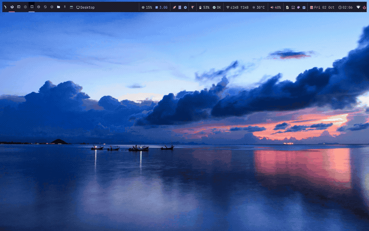
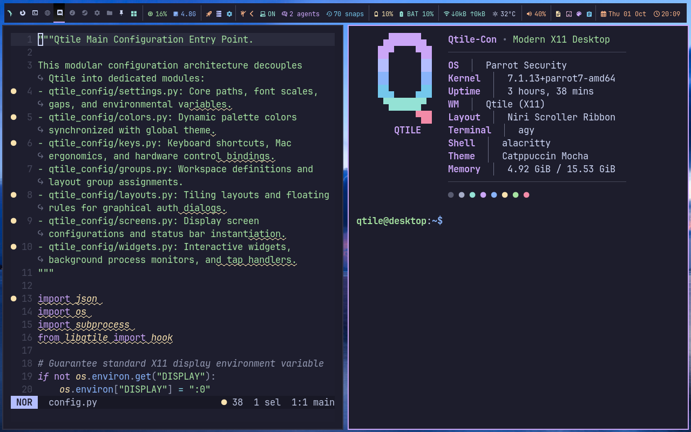
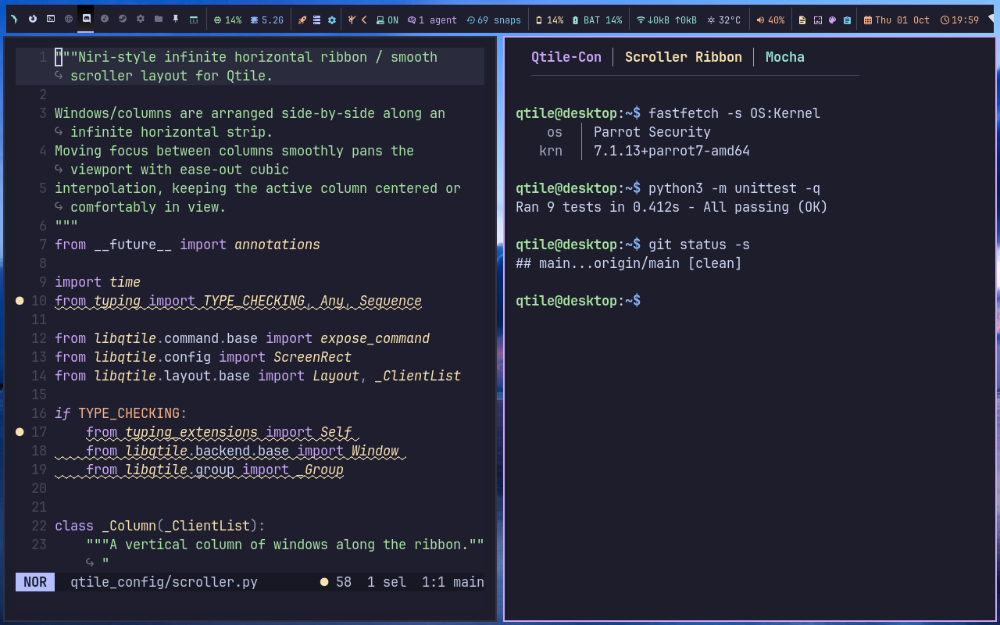
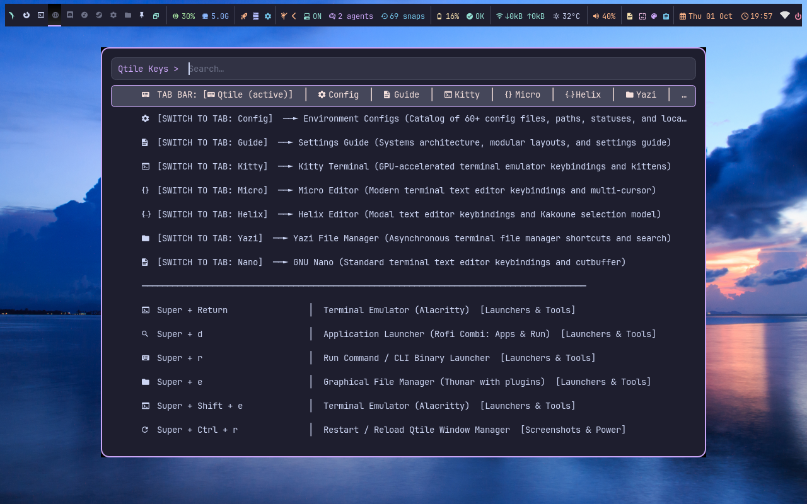
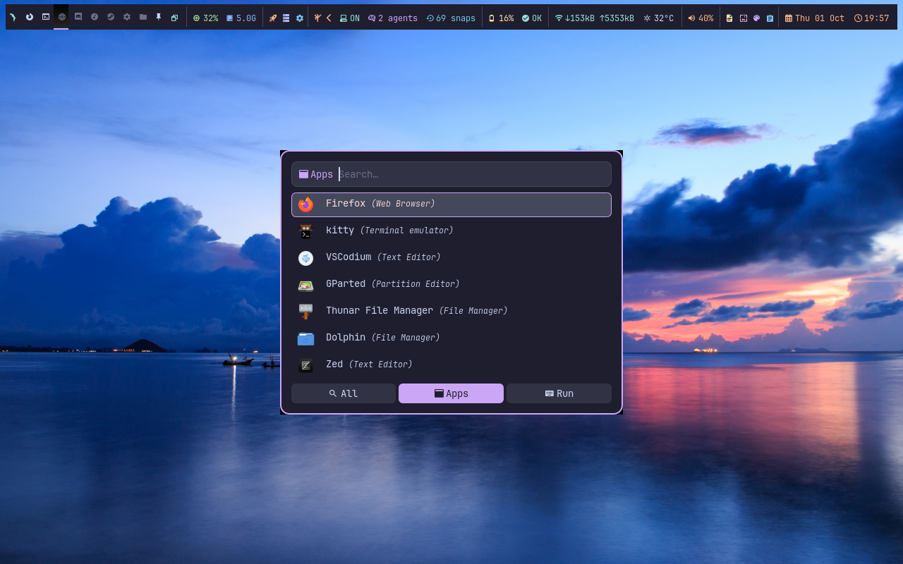
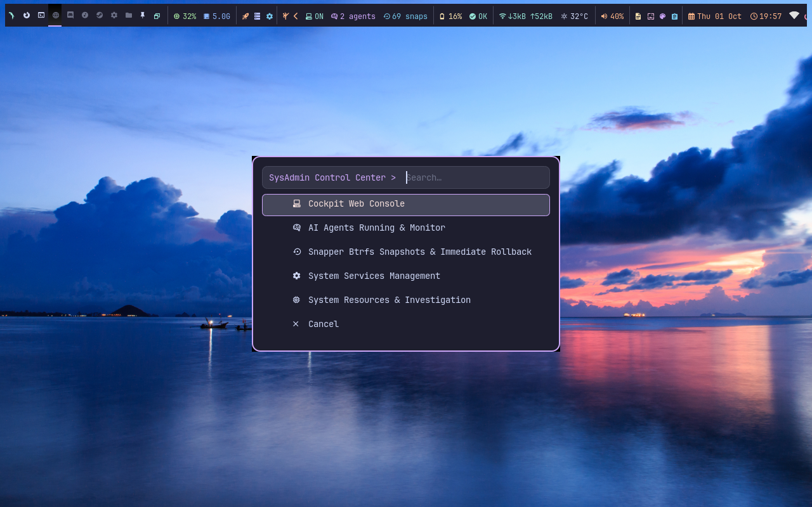
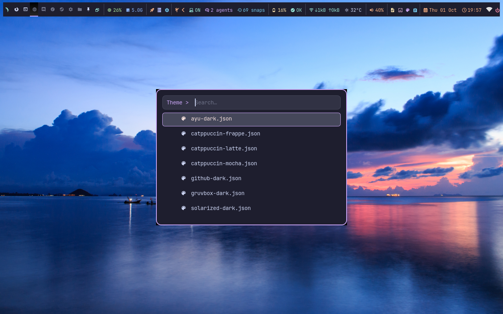

# Qtile-Con: Modern Cohesive X11 Desktop Environment

A high-performance, modular Qtile desktop configuration engineered specifically for **X11**, combining modern aesthetic capsule styling, sub-millisecond touchpad gestures, the Niri-inspired smooth `Scroller` ribbon layout, multi-application synchronized color themes, and built-in sysadmin tooling.

```text
       ___  __   _  __           ______            
      / _ \/ /_ (_)/ /___       / ____/___   ____  
     / // / __// // // -_)     / /    / _ \ / _ \  
    /____/\__//_//_/ \__/      \___/  \___//_//_/  
   Modern Cohesive X11 Desktop Environment for Qtile
```

---

## Visual Showcase & 60-Second Feature Tour



> 📹 **High-Definition Video**: A 60-second 1280x800 H.264 MP4 recording is available in [`assets/qtile_con_demo.mp4`](assets/qtile_con_demo.mp4) showcasing the complete workflow, Niri scroller ribbon animations, tabbed cheatsheet, application launcher, SysAdmin drawer, and theme switching.

### Desktop Environment Screenshots

| **Desktop Overview & Fastfetch Branding** | **Niri Scroller Ribbon Tiling** |
|:---:|:---:|
|  |  |
| *Active workspace: Helix editor, Fastfetch Qtile branding, and top capsule bar* | *Niri-inspired horizontal scroller layout with Helix editor & test runner* |

| **Interactive Tabbed Cheatsheet** | **Application Launcher** |
|:---:|:---:|
|  |  |
| *8-tab reference palette with dynamic hotkey parsing (`Super + /`)* | *Fuzzy application search with category tabs & Catppuccin styling* |

| **SysAdmin Drawer & Control Center** | **Global Theme Synchronizer** |
|:---:|:---:|
|  |  |
| *Administrative hub with Cockpit, AI agent monitor & Snapper snapshots* | *Live cross-application color palette switcher (7 themes)* |

---

## Quickstart (Under 1 Minute Setup)

```bash
# 1. Clone repository
git clone https://github.com/Opposum0112/Qtile-con.git
cd Qtile-con

# 2. Preview planned actions without modifying your system
./install.sh --dry-run

# 3. Install and deploy (OS-aware, idempotent, and non-destructive)
./install.sh

# 4. Validate configuration syntax
./scripts/check-config
```

Log out of your current desktop session, select **Qtile** in your display manager (GDM, SDDM, LightDM), and log in!

---

## Architecture Overview

```text
  ┌────────────────────────────────────────────────────────────────────────┐
  │                         Qtile-Con Top Bar                              │
  │ [Tags 1..9]  [Layout]  [Title]  │  [󰠬 SysAdmin]  [Stats]  [Clock]       │
  └────────────────┬───────────────────────────────┬───────────────────────┘
                   │                               │
                   ▼                               ▼
       ┌───────────────────────┐       ┌───────────────────────┐
       │   Window Management   │       │   Integrated Tools    │
       │ • Niri Scroller Ribbon│       │ • SysAdmin Drawer     │
       │ • Multi-Columns Tiling│       │ • Cross-Tool Theming  │
       │ • MonadTall & Wide    │       │ • C Touchpad Gestures │
       │ • Max & Float Windows │       │ • 8-Tab Cheatsheet    │
       └───────────────────────┘       └───────────────────────┘
```

| Layer | Component | Description |
|---|---|---|
| **Top Bar** | `qtile_config/screens.py`, `widgets.py` | Pill capsules, workspace tags, layout indicator, hardware metrics, clock |
| **SysAdmin** | `scripts/cockpit-info`, `ai-agents-info`, `snapper-info` | Clickable drawer: Cockpit console, running AI agents & LLM monitor, Snapper snapshots |
| **Layouts** | `qtile_config/scroller.py`, `layouts.py` | Niri-inspired smooth horizontal scroller, dynamic column widths, multi-monitor tiling |
| **Themes** | `scripts/apply-global-theme`, `themes/` | 7 synchronized palettes across Qtile, Alacritty, Kitty, Dunst, Micro, Helix, Yazi, Rofi |
| **Input** | `scripts/gesture-daemon.c`, `udev/` | Sub-millisecond XInput 2.4 gesture daemon & non-root udev backlight permissions |

---

## Key Features

- **Lean Memory Footprint**: Strictly maintains an idle desktop footprint **under 800 MB** (verified baseline is **~150 MB** idle with core desktop services active).
- **Niri-Style Smooth Scroller Layout (`Scroller`)**: Infinite horizontal ribbon layout with fluid ease-out cubic viewport scrolling, automatic new-column placement, vertical window stacking, preset width cycling (1/3, 1/2, 2/3, full), and column grouping (`consume`/`expel`/`split`).
- **SysAdmin Expandable Drawer (`󰠬`)**: Expandable bar capsule revealing three live administrative tools on click:
  - **Cockpit Web Console**: Socket status, service control, and browser launcher (`https://localhost:9090`).
  - **Running AI Agents & LLM Process Monitor**: Detects Antigravity (`agy`), Goose, OpenAI Codex, xAI Grok, Claude Code, Aider, Ollama, and ChatGPT with `witr` process causality tracing and process termination.
  - **Snapper Btrfs Snapshot Manager**: Snapshot listing with one-click immediate system rollback.
- **Tabbed Interactive Cheatsheet (`Super + /`)**: In-place fuzzy-searchable tabbed reference palette with 8 dedicated modes (`qtile`, `config`, `guide`, `kitty`, `micro`, `helix`, `yazi`, `nano`). Qtile keybindings update dynamically when `qtile_config/keys.py` is edited.
- **Synchronized Global Themes**: 7 built-in themes (Catppuccin Mocha, Frappe, Latte, Gruvbox Dark, GitHub Dark, Ayu Dark, Solarized Dark) with instant live hot-reloading across Qtile, Alacritty, Kitty, Micro, Helix, Yazi, Dunst, and all Rofi menus.
- **Native X11 Gesture Daemon**: Zero-dependency C daemon (`scripts/gesture-daemon`) capturing multi-finger swipes and pinches via XInput 2.4 without requiring root privileges or input group membership.
- **OS-Aware Idempotent Installer (`install.sh`)**: Multi-distro package manager detection across 8 operating systems with automatic dependency resolution and user opt-outs.
- **Clean Uninstaller (`uninstall.sh`)**: Completely restores previous configs and cleans up deployed files, fonts, and packages.

---

## Supported Operating Systems & Package Managers

`install.sh` and `uninstall.sh` natively detect and support:

| Distribution / OS | Package Manager | Status |
|---|---|---|
| **Debian / Ubuntu / Parrot OS / Kali / Mint** | `apt` | Fully Supported |
| **Arch Linux / Manjaro / EndeavourOS / Garuda** | `pacman` | Fully Supported |
| **Fedora Linux / Red Hat / CentOS / Rocky** | `dnf` | Fully Supported |
| **openSUSE Leap 16.1 & Tumbleweed** | `zypper` | Fully Supported |
| **Solus Linux** | `eopkg` | Fully Supported |
| **Void Linux** | `xbps` | Fully Supported |
| **FreeBSD** | `pkg` | Fully Supported |
| **Gentoo Linux** | `emerge` | Fully Supported |

---

## Manual Prerequisites & Distribution Commands

If installing dependencies manually without `install.sh`, run the command matching your host OS:

### Debian / Ubuntu / Parrot OS / Kali Linux (`apt`)
```bash
sudo apt-get update && sudo apt-get install -y \
  python3 python3-pip pipx python3-cairocffi python3-xcffib python3-dbus python3-psutil python3-requests libpangocairo-1.0-0 \
  rofi alacritty kitty micro feh maim xclip xsel playerctl curl jq libnotify-bin btop htop pamixer pavucontrol \
  alsa-utils brightnessctl network-manager-gnome i3lock xdotool libinput-tools man-db gcc make libx11-dev libxtst-dev git cockpit snapper
```

### Arch Linux / Manjaro / EndeavourOS (`pacman`)
```bash
sudo pacman -S --needed --noconfirm \
  qtile python python-pip python-pipx python-cairocffi python-xcffib python-dbus python-psutil python-requests pango \
  rofi alacritty kitty micro feh maim xclip xsel playerctl curl jq libnotify btop htop pamixer pavucontrol \
  alsa-utils brightnessctl network-manager-applet nm-connection-editor i3lock xdotool libinput man-db gcc make libx11 libxtst git cockpit snapper
```

### Fedora Linux (`dnf`)
```bash
sudo dnf install -y \
  qtile python3 python3-pip python3-pipx python3-cairocffi python3-xcffib python3-dbus python3-psutil python3-requests pango \
  rofi alacritty kitty micro feh maim xclip xsel playerctl curl jq libnotify btop htop pamixer pavucontrol \
  alsa-utils brightnessctl NetworkManager-gnome i3lock xdotool libinput man-db gcc make libX11-devel libXtst-devel git cockpit snapper
```

### openSUSE Leap 16.1 & Tumbleweed (`zypper`)
```bash
sudo zypper install -y \
  qtile python3 python3-pip python3-pipx python3-cairocffi python3-xcffib python3-dbus-python python3-psutil python3-requests pango \
  rofi alacritty kitty micro feh maim xclip xsel playerctl curl jq libnotify-tools btop htop pamixer pavucontrol \
  alsa-utils brightnessctl NetworkManager-applet i3lock xdotool man-db gcc make libX11-devel libXtst-devel git cockpit snapper
```

### Solus Linux (`eopkg`)
```bash
sudo eopkg install -y \
  python3 git rofi alacritty kitty micro feh maim xclip xsel playerctl curl jq libnotify pipx \
  btop htop pamixer pavucontrol alsa-utils brightnessctl nm-connection-editor network-manager-applet i3lock xdotool man-db gcc make fd ripgrep
```

### Void Linux (`xbps`)
```bash
sudo xbps-install -Sy \
  python3 git rofi alacritty feh maim xclip xsel playerctl curl jq libnotify python3-pip pipx \
  python3-cairocffi python3-xcffib python3-dbus python3-psutil python3-requests pango qtile \
  btop htop pamixer pavucontrol alsa-utils brightnessctl NetworkManager i3lock micro kitty dunst xdotool man-db gcc make libX11-devel libXtst-devel fd ripgrep
```

### FreeBSD (`pkg`)
```bash
sudo pkg install -y \
  python3 git rofi alacritty feh playerctl curl jq libnotify \
  py311-pip py311-cairocffi py311-xcffib py311-dbus py311-psutil py311-requests pango \
  btop htop pamixer pavucontrol alsa-utils i3lock micro kitty dunst xdotool man-db gcc gmake libX11 libXtst fd-find ripgrep
```

### Gentoo Linux (`emerge`)
```bash
sudo emerge --ask=n \
  dev-lang/python dev-vcs/git x11-misc/rofi x11-terms/alacritty media-gfx/feh media-gfx/maim x11-misc/xclip x11-misc/xsel \
  media-sound/playerctl net-misc/curl app-misc/jq x11-libs/libnotify dev-python/pip dev-python/pipx dev-python/cairocffi \
  dev-python/xcffib dev-python/dbus-python dev-python/psutil dev-python/requests x11-libs/pango x11-wm/qtile \
  sys-process/btop sys-process/htop media-sound/pamixer media-sound/pavucontrol media-sound/alsa-utils sys-power/brightnessctl \
  net-misc/networkmanager x11-misc/i3lock app-editors/micro x11-terms/kitty x11-misc/dunst x11-misc/xdotool \
  sys-apps/man-db sys-devel/gcc sys-devel/make x11-libs/libX11 x11-libs/libXtst sys-apps/fd sys-apps/ripgrep
```

---

## Installer & Uninstaller CLI Options

### `install.sh` Options
```bash
./install.sh [OPTIONS]
```
| Flag | Description |
|---|---|
| `--dry-run` | Shows detected OS, package manager, and planned actions without making changes |
| `--yes`, `-y` | Non-interactive mode (automatically accepts all default prompts) |
| `--no-deps` | Skips system package installation; only configures Qtile desktop files |
| `--no-sysadmin` | **Opt-out**: Do not install Cockpit Web Console and Snapper Btrfs tools |
| `--no-secondary` | **Opt-out**: Do not install secondary editors/terminals (Kitty, Micro, Helix, Yazi) |
| `--no-fonts` | **Opt-out**: Do not download JetBrainsMono Nerd Font (uses existing system fonts) |
| `--no-ai` | **Opt-out**: Do not configure background AI agent monitoring tools |
| `-h`, `--help` | Display usage help and exit |

### `uninstall.sh` Options
```bash
./uninstall.sh [OPTIONS]
```
| Flag | Description |
|---|---|
| `--dry-run` | Shows all files, directories, and packages that would be removed without deleting anything |
| `--yes`, `-y` | Skips interactive confirmation prompts |
| `--purge` | Completely removes configuration **AND** uninstalls packages installed by `install.sh` |
| `--restore` | Automatically restores prior configuration backup if available |
| `-h`, `--help` | Display usage help and exit |

---

## Essential Keybindings Cheat Sheet

Quickly open the interactive cheatsheet with **`Super + /`**.

| Shortcut | Function | Description |
|---|---|---|
| **`Super + /`** | Interactive Cheatsheet | 8-tab reference palette (Qtile, Config, Guide, Kitty, Micro, Helix, Yazi, Nano) |
| **`Super + Return`** | Terminal | Spawns primary terminal (Alacritty) |
| **`Super + d`** | App Launcher | Multi-tab launcher (All, Apps, Run, Files, Content) |
| **`Super + r`** | Run Command | Dedicated CLI binary execution prompt |
| **`Super + e`** | File Manager | Opens graphical file manager (Thunar) |
| **`Super + Shift + e`** | Terminal File Manager | Opens Yazi in terminal |
| **`Super + Shift + t`** | Global Theme Switcher | Interactive palette selector with instant cross-tool sync |
| **`Super + Shift + w`** | Wallpaper & Font Grid | Graphical 3x3 thumbnail card grid wallpaper picker |
| **`Super + v`** | Clipboard History | Searchable clipboard history manager |
| **`Super + Shift + v`** | Volume Slider | Floating graphical audio volume control |
| **`Super + Shift + q`** | Close Window | Gracefully closes focused window |
| **`Super + Ctrl + q`** | Logout Menu | Power off, reboot, lock screen, or log out |
| **`Super + Ctrl + r`** | Restart Qtile | Hot-reloads configuration in-place without losing client windows |
| **`Super + Left / Right`** | Column Navigation | Smooth horizontal ribbon scrolling in `Scroller` layout |
| **`Super + Up / Down`** | Window Focus | Navigate stacked windows within column |
| **`Super + w`** | Width Preset Cycle | Cycles column width (1/3, 1/2, 2/3, Full) |
| **`Super + Ctrl + s`** | Toggle Split | Toggles vertical column split vs stacked tab view |
| **`Super + Ctrl + e`** | Expel Window | Moves active window into its own new column |
| **`Super + 1..9`** | Switch Workspace | Jumps to numbered workspace tag |
| **`Super + Ctrl + 1..9`** | Move to Workspace | Moves window to tag and follows focus |

---

## Compact Repository Structure

```text
Qtile-con/
├── config.py                 # Primary Qtile entrypoint
├── install.sh                # OS-aware idempotent installer
├── uninstall.sh              # Manifest-backed clean uninstaller
├── qtile_config/             # Modular Python configuration
│   ├── __init__.py           # Package initializer
│   ├── colors.py             # Active color palette loader
│   ├── groups.py             # Workspaces 1-9 & app-routing rules
│   ├── keys.py               # Keybindings & media keys
│   ├── layouts.py            # Layouts & window styling
│   ├── scroller.py           # Niri-style smooth scroller ribbon layout engine
│   ├── screens.py            # Screen dimensions & capsule top bar
│   ├── settings.py           # Unified 4-layer PATH & environment defaults
│   └── widgets.py            # Pill capsules, SysAdmin drawer & watchdogs
├── scripts/                  # Executable utility & automation scripts
│   ├── autostart             # Session daemon launcher & PATH exporter
│   ├── apply-global-theme    # Cross-application theme synchronization engine
│   ├── check-config          # Integrity & syntax validator
│   ├── cockpit-info          # Cockpit Web Console management
│   ├── ai-agents-info        # Running AI Agents & LLM process monitor
│   ├── snapper-info          # Snapper Btrfs snapshot manager & rollback
│   ├── keybindings-cheatsheet# 8-tab interactive Rofi cheatsheet
│   ├── gesture-daemon.c      # Native sub-ms XInput 2.4 gesture daemon (C source)
│   ├── set-theme             # Themed Rofi global theme picker
│   ├── set-wallpaper         # Wallpaper 3x3 thumbnail card grid selector
│   └── ...                   # Volume, Wi-Fi, battery, screenshot, & search scripts
├── themes/                   # Presets (Catppuccin Mocha/Frappe/Latte, Gruvbox, Ayu, etc.)
├── alacritty/                # Starter Alacritty config & theme definitions
├── kitty/                    # Starter Kitty configuration
├── helix/                    # Starter Helix configuration
├── yazi/                     # Starter Yazi configuration
├── dunst/                    # Starter Dunst notification daemon configuration
├── gestures/                 # libinput-gestures.conf mapping rules
├── udev/                     # udev backlight brightness permissions rule
├── docs/                     # Detailed architectural guides & keybindings reference
└── tests/
    └── test_suite.py         # Consolidated master test suite (9 comprehensive tests)
```

---

## Verification & Testing

Run the full integration test suite locally:

```bash
# Validate Qtile configuration syntax
./scripts/check-config

# Run master integration test suite (9 comprehensive tests)
python3 -m unittest discover -s tests -v
```

---

## Credits & Acknowledgements

### Special Thanks to the Qtile Community & Open Source
Heartfelt gratitude to the entire **[Qtile Community](https://qtile.org)**, the Qtile core maintainers, and contributors who build and foster one of the most flexible, modular, and developer-friendly tiling window managers in existence. 

This project also stands on the shoulders of the vast, collaborative **global open source community** whose passion, transparency, and dedication to libre software power modern computing ecosystems worldwide.

### Core Open Source Utilities Used in Qtile-Con

Qtile-Con brings together and builds upon exceptional open-source utilities:

| Tool | Description | Repository |
|---|---|---|
| **Qtile** | Hackable tiling window manager in Python | [qtile/qtile](https://github.com/qtile/qtile) |
| **witr** | *Why Is This Running?* Process Causation Tracer | [pranshuparmar/witr](https://github.com/pranshuparmar/witr) |
| **Catppuccin** | Soothing pastel color palette | [catppuccin/catppuccin](https://github.com/catppuccin/catppuccin) |
| **Rofi** | Window switcher, application launcher, and dmenu replacement | [davatorium/rofi](https://github.com/davatorium/rofi) |
| **Alacritty** | Fast, GPU-accelerated terminal emulator | [alacritty/alacritty](https://github.com/alacritty/alacritty) |
| **Kitty** | Modern, feature-rich GPU terminal emulator | [kovidgoyal/kitty](https://github.com/kovidgoyal/kitty) |
| **Micro** | Intuitive terminal text editor with multi-cursor support | [zyedidia/micro](https://github.com/zyedidia/micro) |
| **Helix** | Post-modern modal text editor with Kakoune selection model | [helix-editor/helix](https://github.com/helix-editor/helix) |
| **Yazi** | Blazing-fast asynchronous terminal file manager | [sxyazi/yazi](https://github.com/sxyazi/yazi) |
| **Dunst** | Highly customizable lightweight notification daemon | [dunst-project/dunst](https://github.com/dunst-project/dunst) |
| **Cockpit** | Web-based graphical interface for Linux systems | [cockpit-project/cockpit](https://github.com/cockpit-project/cockpit) |
| **Snapper** | Linux filesystem snapshot manager for Btrfs | [openSUSE/snapper](https://github.com/openSUSE/snapper) |
| **libinput-gestures** | Multi-touch gesture mapper for libinput | [bulletmark/libinput-gestures](https://github.com/bulletmark/libinput-gestures) |
| **ripgrep** | Blazing fast line-oriented regex search tool | [BurntSushi/ripgrep](https://github.com/BurntSushi/ripgrep) |
| **fd** | Fast, user-friendly alternative to find | [sharkdp/fd](https://github.com/sharkdp/fd) |
| **feh** | Lightweight X11 image viewer and wallpaper setter | [derf/feh](https://github.com/derf/feh) |
| **maim** | Flexible screenshot utility for X11 | [naelstrof/maim](https://github.com/naelstrof/maim) |
| **pamixer** | Command-line mixer for PulseAudio / PipeWire | [cdemoulins/pamixer](https://github.com/cdemoulins/pamixer) |
| **Nerd Fonts** | Iconic font patcher and glyph collection | [ryanoasis/nerd-fonts](https://github.com/ryanoasis/nerd-fonts) |

---

## Contributing

We welcome community feedback and contributions! Please read our [Contributing Guidelines](CONTRIBUTING.md) to get started.

> 💖 **Community Note**: Be kind, welcoming, respectful, and constructive in all interactions.

---

## License

This project is licensed under the [MIT License](LICENSE).

---

## 🤖 AI Usage & Assistance Disclosure

This project is **AI-assisted**. It was designed, architected, developed, and refined with the assistance of advanced AI coding assistants working in pair-programming collaboration with the author.

- **Human-Reviewed & Tested**: While AI tools were used for code generation, structural refactoring, cross-distro package mapping, and documentation drafting, all components—including Python Qtile modules, the native C gesture daemon, shell scripts, and installation pipelines—have been reviewed, syntax-checked (`bash -n`, `python -m compileall`, `qtile check`), and verified with comprehensive integration tests.
- **Commitment to Transparency**: We believe in full honesty and disclosure regarding the role of AI in open source software development.
- **Contribution Policy**: Contributions developed with the assistance of AI are welcome, provided that contributors review, understand, test, and take ownership of their code, ensuring it satisfies project architectural standards, multi-distro compatibility, safety guidelines, and lean memory constraints (< 800 MB).
- **Warranty Disclaimer**: In accordance with the MIT License, this software is provided "as is", without warranty of any kind. Always test in a non-production or virtual environment first using `./install.sh --dry-run`.

